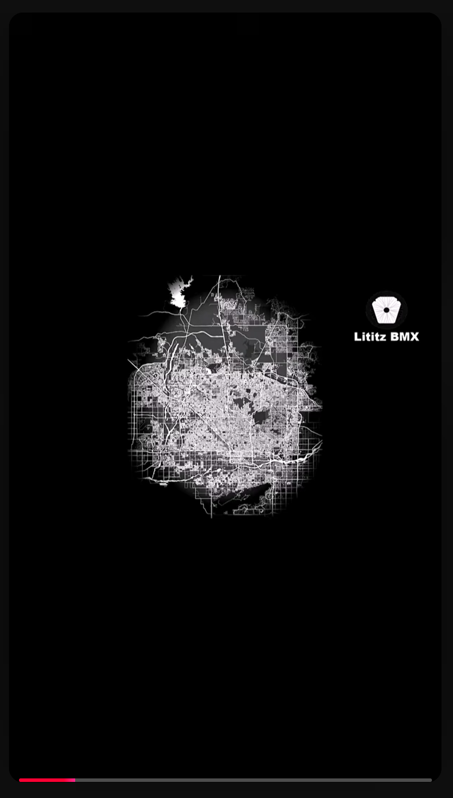

  

<em>Original supplied published-frame capture for GM-011; preserved byte-for-byte. Select the image to open the full-resolution evidence file.</em>

# GM-011 - Harry loved to drive; found outside Phoenix

<a href="../GM-010-MISSING/README.md">← GM-010</a> &nbsp;·&nbsp; <a href="../../README.md">Visual Shorts Index</a> &nbsp;·&nbsp; <a href="../../../../README.md">Parent Episode 4 Dossier</a> &nbsp;·&nbsp; <a href="../GM-012A/README.md">GM-012A →</a>

| Field | Preserved record |
|---|---|
| Parent dossier | [fbc-004-greg-mathias-chasing-harry-hof](../../../../README.md) |
| Source number | `11` |
| Duration | 0:36 |
| Publication date | 2025-11-10 |
| Visibility/state in supplied Studio evidence | Public / Published |
| Direct Short URL | Not supplied; not invented |
| Parent recording | [https://www.youtube.com/watch?v=EUTzVetaoLc](https://www.youtube.com/watch?v=EUTzVetaoLc) |
| Parent transcript reference | 7:53-8:21 (provisional) |

## Visible published title

> 11. Harry Leary loved to drive. He went driving and they found him about 60 miles outside of Phoenix

The title above is a transcription of the title visible in the supplied YouTube Studio evidence. UI truncation is represented by an ellipsis rather than silently completed.

## Supplied working-source title

> Fireside BMX Chat w/ Greg Mathias - went driving and they found his body about 60 miles from Phoenix.

## Supplied description

Harry Leary loved to drive. He went driving and they found his body about 60 miles from Phoenix. He died of heatstroke. Greg believes that Harry died Wednesday night or Thursday morning but wasn’t found until Saturday.

**Description source:** working-source PDF.

## Evidence

- [Published-frame capture](../../source/evidence/published-frames-original/2026-07-22_16-17-31.png)
- [Publication status evidence](../../source/evidence/studio/2026-07-22_17-09-22.png)
- [Record metadata](metadata.json)
- [Preserved published description](source/published-description.md)
- [Parent transcript reference](source/transcript-reference.md)
- [Provenance](docs/provenance.md)
- [Verification notes](docs/verification-notes.md)

## Qualification

Cause and timing of death are preserved as interview/publication claims, not an independent medical or official finding.

---

<a href="../GM-010-MISSING/README.md">← GM-010</a> &nbsp;·&nbsp; <a href="../../README.md">Visual Shorts Index</a> &nbsp;·&nbsp; <a href="../../../../README.md">Parent Episode 4 Dossier</a> &nbsp;·&nbsp; <a href="../GM-012A/README.md">GM-012A →</a>

