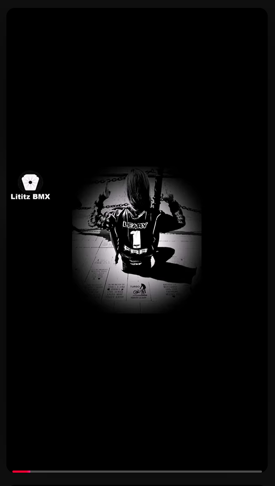

  

<em>Original supplied published-frame capture for GM-020; preserved byte-for-byte. Select the image to open the full-resolution evidence file.</em>

# GM-020 - Bobblehead in the Hall of Fame case

<a href="../GM-019/README.md">← GM-019</a> &nbsp;·&nbsp; <a href="../../README.md">Visual Shorts Index</a> &nbsp;·&nbsp; <a href="../../../../README.md">Parent Episode 4 Dossier</a> &nbsp;·&nbsp; <a href="../GM-021/README.md">GM-021 →</a>

| Field | Preserved record |
|---|---|
| Parent dossier | [fbc-004-greg-mathias-chasing-harry-hof](../../../../README.md) |
| Source number | `20` |
| Duration | 0:54 |
| Publication date | 2025-11-10 |
| Visibility/state in supplied Studio evidence | Public / Published |
| Direct Short URL | Not supplied; not invented |
| Parent recording | [https://www.youtube.com/watch?v=EUTzVetaoLc](https://www.youtube.com/watch?v=EUTzVetaoLc) |
| Parent transcript reference | 18:31-19:28 (provisional) |

## Visible published title

> 20. Greg Mathias donated one of the Harry Leary bobbleheads to @usabmxvideos HOF - it’s in the case

The title above is a transcription of the title visible in the supplied YouTube Studio evidence. UI truncation is represented by an ellipsis rather than silently completed.

## Supplied working-source title

> Fireside BMX Chat w/ Greg Mathias - He donated a Harry Leary bobblehead to the National BMX Hall of Fame

## Supplied description

Greg Mathias donated a Harry Leary bobblehead to the National BMX Hall of Fame. The bobble head itself is wearing a Fall Risk Racing kit, which was Harry Leary’s last sponsor. The Harry Leary Bobblehead Donation Was Made by Greg Mathias to the National BMX Hall of Fame #bmx BMX Team USA's Greg Mathias shares his experience donating a special Harry Leary bobblehead to the National BMX HoF. The figure, dressed in a Fall Risk Racing (FRR) kit—Harry's last sponsor—is just one example of Greg’s commitment to preserving Harry's legacy.

**Description source:** working-source PDF.

## Evidence

- [Published-frame capture](../../source/evidence/published-frames-original/2026-07-22_16-37-30.png)
- [Publication status evidence](../../source/evidence/studio/2026-07-22_17-09-05.png)
- [Record metadata](metadata.json)
- [Preserved published description](source/published-description.md)
- [Parent transcript reference](source/transcript-reference.md)
- [Provenance](docs/provenance.md)
- [Verification notes](docs/verification-notes.md)

## Qualification

No special medical qualification is required for the core descriptive statement. All oral-history claims remain attributed unless independently verified.

---

<a href="../GM-019/README.md">← GM-019</a> &nbsp;·&nbsp; <a href="../../README.md">Visual Shorts Index</a> &nbsp;·&nbsp; <a href="../../../../README.md">Parent Episode 4 Dossier</a> &nbsp;·&nbsp; <a href="../GM-021/README.md">GM-021 →</a>

