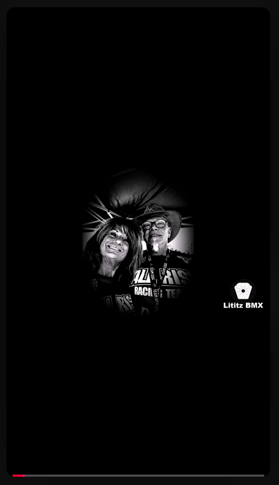

  

<em>Original supplied published-frame capture for GM-023; preserved byte-for-byte. Select the image to open the full-resolution evidence file.</em>

# GM-023 - Diamond Back from Australia donated then sold

<a href="../GM-022/README.md">← GM-022</a> &nbsp;·&nbsp; <a href="../../README.md">Visual Shorts Index</a> &nbsp;·&nbsp; <a href="../../../../README.md">Parent Episode 4 Dossier</a> &nbsp;·&nbsp; <a href="../GM-024/README.md">GM-024 →</a>

| Field | Preserved record |
|---|---|
| Parent dossier | [fbc-004-greg-mathias-chasing-harry-hof](../../../../README.md) |
| Source number | `23` |
| Duration | 0:44 |
| Publication date | 2025-11-10 |
| Visibility/state in supplied Studio evidence | Public / Published |
| Direct Short URL | Not supplied; not invented |
| Parent recording | [https://www.youtube.com/watch?v=EUTzVetaoLc](https://www.youtube.com/watch?v=EUTzVetaoLc) |
| Parent transcript reference | 21:20-22:07 (provisional) |

## Visible published title

> 23. Greg talked with gOrk about a Diamond Back bike Harry got in Australia - donated - then sold it

The title above is a transcription of the title visible in the supplied YouTube Studio evidence. UI truncation is represented by an ellipsis rather than silently completed.

## Supplied working-source title

> Fireside BMX Chat w/ Greg Mathias - He Talked with gOrk about an old DB Harry had on loan

## Supplied description

When Greg took Harry’s old 24” Daylight BMX, he was talking with Gork about an old Diamondback Harry had on loan to the museum. Harry got an HLT from someone in Australia. Harry eventually took the bike out of the museum and sold it. The museum wanted Harry to keep it there but - “what are you going to do?” - Greg Mathias

**Description source:** working-source PDF.

## Evidence

- [Published-frame capture](../../source/evidence/published-frames-original/2026-07-22_16-44-02.png)
- [Publication status evidence](../../source/evidence/studio/2026-07-22_17-09-05.png)
- [Record metadata](metadata.json)
- [Preserved published description](source/published-description.md)
- [Parent transcript reference](source/transcript-reference.md)
- [Provenance](docs/provenance.md)
- [Verification notes](docs/verification-notes.md)

## Qualification

No special medical qualification is required for the core descriptive statement. All oral-history claims remain attributed unless independently verified.

---

<a href="../GM-022/README.md">← GM-022</a> &nbsp;·&nbsp; <a href="../../README.md">Visual Shorts Index</a> &nbsp;·&nbsp; <a href="../../../../README.md">Parent Episode 4 Dossier</a> &nbsp;·&nbsp; <a href="../GM-024/README.md">GM-024 →</a>

