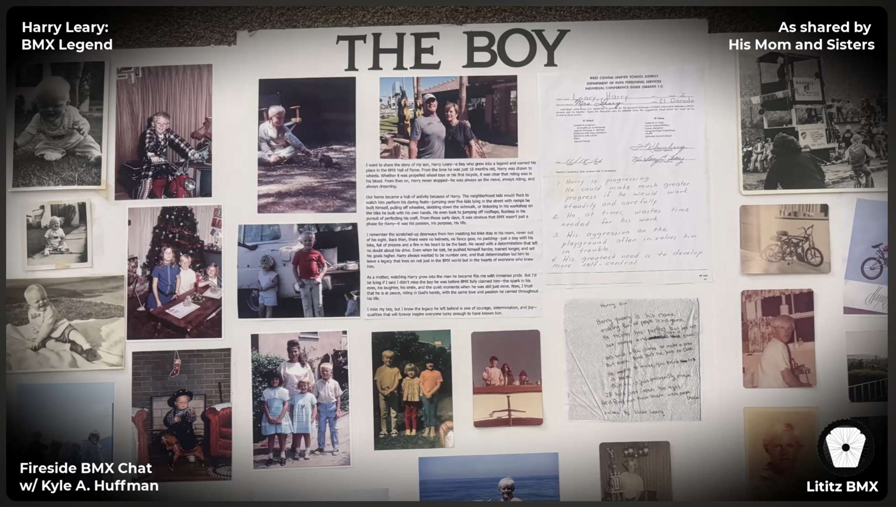

  

# The Boy: Harry Leary as Remembered by His Mother and Sisters

<strong><a href="https://www.youtube.com/watch?v=92rxPCGK6Pg">▶ Watch the complete recording on YouTube</a></strong>

## At a glance

| Field | Record |
|---|---|
| **Record ID** | `fbc-005-the-boy-leary-ladies` |
| **Dossier type** | Interview Dossier |
| **Classification** | Family oral history centered on preserved writings, memorial objects, and multi-generational testimony. |
| **Participants** | Kyle A. Huffman, Beverly Leary, Linda Leary Taylor, Cammie Leary |
| **Setting** | Remote or unspecified conversational setting |
| **Duration** | 21:21 |
| **Preservation status** | Dossier compiled; machine transcript preserved; full audio verification pending |

## Record summary

Beverly Leary and Harry Leary’s sisters Linda and Cammie discuss the family poster board created for Dirtyfest, read three family writings, recall Harry as a child and family member, and describe him through the “One Word” exercise.

## Why this recording matters

Preserves three distinct forms of family testimony and documents the poster board as both a memorial object and the framework for the conversation.

## Explore the dossier

| Public record | Context and provenance | Transcript and access |
|---|---|---|
| [Interview Record](interview-record.md) | [Dossier Contents](docs/dossier-contents.md) | [Working Transcript](transcript/working-transcript.md) |
| [Published Description](source/published-description.md) | [Provenance](docs/provenance.md) | [Transcript Status](docs/transcript-status.md) |
| [YouTube Record](source/youtube-record.md) | [Curator Notes](docs/curator-notes.md) | [Preliminary Chapter Index](docs/chapter-index.md) |
| [Metadata](metadata.json) | [Source Inventory](docs/source-inventory.md) | [Topic Index](docs/topic-index.md) |
| [Citation Record](CITATION.cff) | [Verification Notes](docs/verification-notes.md) | [Rights and Access](docs/rights-and-access.md) |

## Archival authority

The original recording is the primary source. The raw transcript is preserved unchanged as an access aid. Descriptive files identify testimony as testimony and record contradictions rather than silently resolving them.

## Current status

- source package compiled;
- public/private review completed;
- visual access layer completed;
- machine transcript preserved;
- full audio verification pending.

## Derivative clip records added in v1.1.0 Part 1

The following are supporting derivatives of this existing dossier. They do **not** increase the Record Collection dossier count.

- [Clip 2 — Harry Leary: A Eulogy Read by a Sister (Cammie)](derivatives/clips/clip-02-cammie-eulogy/README.md)
- [Clip 3 — Linda Leary’s Handwritten Poem About Harry](derivatives/clips/clip-03-linda-handwritten-poem/README.md)
- [Clip 4 — Beverly Leary with the PULL BMX Magazine Featuring Harry Leary](derivatives/clips/clip-04-pull-bmx-magazine/README.md)
- [Clip 5 — THE BOY Memorial Poster Board](derivatives/clips/clip-05-the-boy-poster-board/README.md)

[Open the derivative-clip register](derivatives/clips/README.md).
