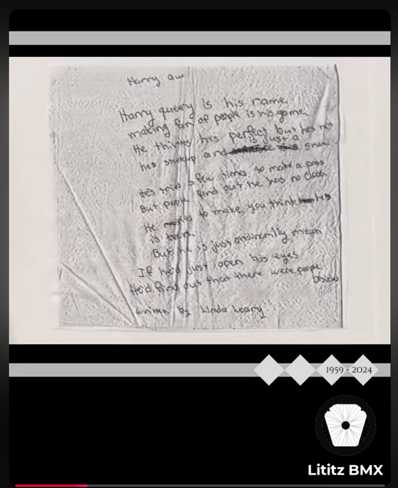

# Clip 3: Linda Leary’s Handwritten Poem About Harry

**Derivative record ID:** `fbc-005-clip-03-linda-handwritten-poem`  
**Parent dossier:** [`fbc-005-the-boy-leary-ladies`](../../../README.md)  
**Status:** Supporting derivative; not a separate dossier

## Summary

A derivative clip preserving Linda Leary Taylor’s older handwritten poem or note about Harry Leary as shown in the supplied source image.

## Source and access

- [Clip record](clip-record.md)
- [Published-description snapshot](source/published-description.md)
- [Source inventory](docs/source-inventory.md)
- [Provenance](docs/provenance.md)
- [Rights and access](docs/rights-and-access.md)
- [Verification notes](docs/verification-notes.md)
- [Transcript status](docs/transcript-status.md)
