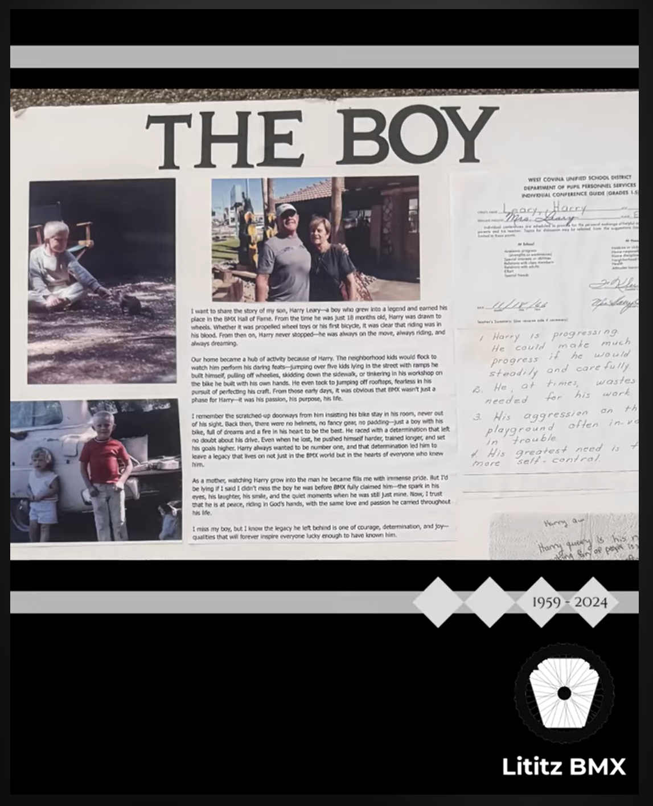

# Clip 5: THE BOY — Memorial Poster Board

**Derivative record ID:** `fbc-005-clip-05-the-boy-poster-board`  
**Parent dossier:** [`fbc-005-the-boy-leary-ladies`](../../../README.md)  
**Status:** Supporting derivative; not a separate dossier

## Summary

A derivative clip focused on the “THE BOY” memorial poster board and the family writings and photographs that structure the parent interview.

## Source and access

- [Clip record](clip-record.md)
- [Published-description snapshot](source/published-description.md)
- [Source inventory](docs/source-inventory.md)
- [Provenance](docs/provenance.md)
- [Rights and access](docs/rights-and-access.md)
- [Verification notes](docs/verification-notes.md)
- [Transcript status](docs/transcript-status.md)
