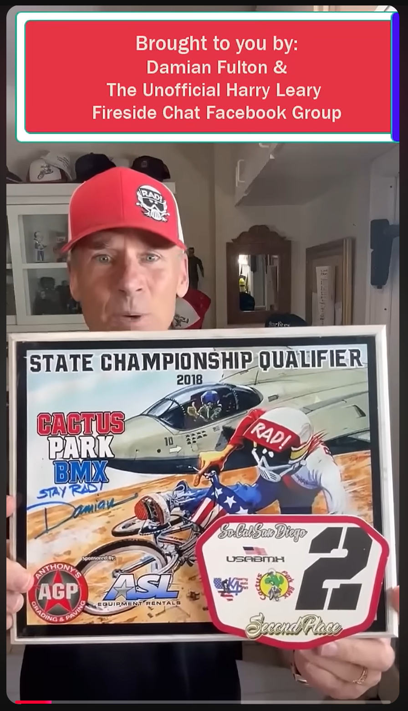

# Damian X. Fulton / Radical Rick / Samaritan’s Purse Campaign Recording

**Record ID:** `fbc-damian-fulton-samaritans-purse`  
**Collection:** Fireside BMX Chat  
**Dossier type:** Recording Dossier  
**Duration:** Not supplied  
**Preservation status:** Dossier compiled for v1.1.0 Part 1; verification gaps recorded

## Record summary

A Fireside BMX Chat campaign/charity recording connecting Damian X. Fulton, Radical Rick artwork, the Unofficial Harry Leary Fireside Chat Facebook Group, a Cactus Park BMX plaque, and a Samaritan’s Purse benefit effort.

## Why this recording matters

Documents how a BMX artifact and artist relationship became part of a charitable campaign while preserving the recording under its established Fireside BMX Chat editorial home.

## Source caution

The individual source URL, publication date, duration, or exact platform title is marked as unavailable whenever it was not present in the accessible build bundle. Missing information has not been invented.

## Explore the dossier

| Public record | Context and provenance | Transcript and access |
|---|---|---|
| [Recording Record](recording-record.md) | [Dossier Contents](docs/dossier-contents.md) | [Transcript Status](docs/transcript-status.md) |
| [Published Description Snapshot](source/published-description.md) | [Provenance](docs/provenance.md) | [Chapter Index](docs/chapter-index.md) |
| [YouTube / Source Record](source/youtube-record.md) | [Curator Notes](docs/curator-notes.md) | [Topic Index](docs/topic-index.md) |
| [Metadata](metadata.json) | [Source Inventory](docs/source-inventory.md) | [Rights and Access](docs/rights-and-access.md) |
| [Citation Record](CITATION.cff) | [Verification Notes](docs/verification-notes.md) | [Revision History](docs/revision-history.md) |

## Related records

- [Fireside BMX Chat — Episode 1: Damian X. Fulton](../fbc-001-damian-x-fulton/README.md)
- [Custom Hooligan BMX Radical Rick figure](../../../unboxing/records/unb-hooligan-radical-rick-figure/README.md)

## Archival authority

The original recording is the primary source. Submitted images are preserved unchanged. Machine transcripts, when supplied, are preserved unchanged and corrected only in a separate labeled access layer.
