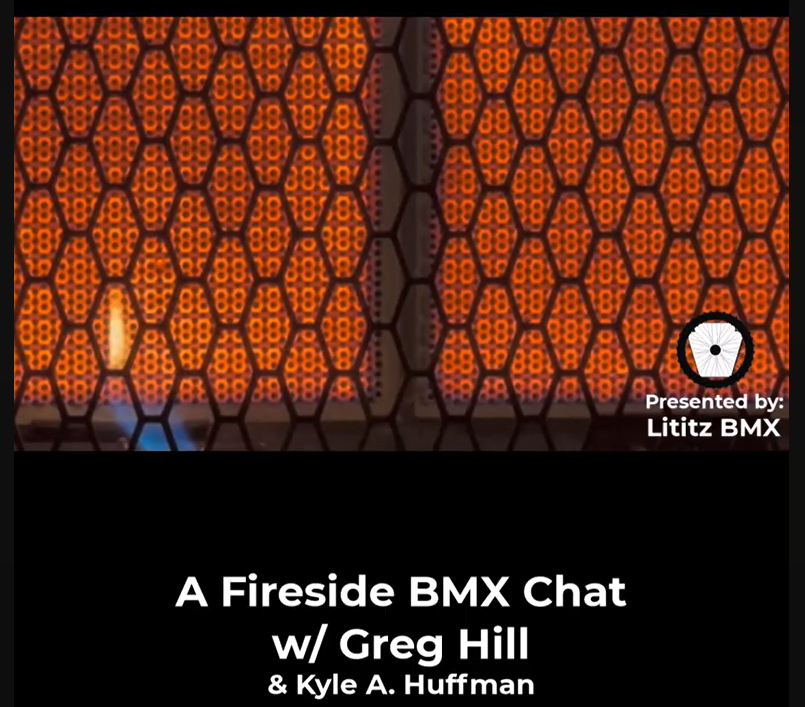

  

# Fireside BMX Chat: Greg Hill — Floored

<strong><a href="https://www.youtube.com/watch?v=EI_tBe4Gf-A">▶ Watch the complete recording on YouTube</a></strong>

## At a glance

| Field | Record |
|---|---|
| **Record ID** | `fbc-greg-hill-floored` |
| **Dossier type** | Interview Dossier |
| **Classification** | Experiential interview that begins as a garage-floor consultation and evolves into BMX oral history. |
| **Participants** | Kyle A. Huffman, Greg Hill, Anne-Marie Huffman |
| **Setting** | Kyle A. Huffman’s garage; exact street address intentionally excluded |
| **Duration** | 16:54 |
| **Preservation status** | Dossier compiled; machine transcript preserved; full audio verification pending |

## Record summary

Greg Hill visits Kyle’s garage to discuss flooring options, materials, process, cost, and warranties. The conversation transitions into memories of Harry Leary, driveway gate practice, BMX competition, the 1985 Grands, and Hill’s decision to close GHP and leave the BMX business.

## Why this recording matters

Preserves the unusual transition from an everyday service consultation into candid BMX oral history about competition, friendship, and the economics of the sport.

## Explore the dossier

| Public record | Context and provenance | Transcript and access |
|---|---|---|
| [Interview Record](interview-record.md) | [Dossier Contents](docs/dossier-contents.md) | [Working Transcript](transcript/working-transcript.md) |
| [Published Description](source/published-description.md) | [Provenance](docs/provenance.md) | [Transcript Status](docs/transcript-status.md) |
| [YouTube Record](source/youtube-record.md) | [Curator Notes](docs/curator-notes.md) | [Preliminary Chapter Index](docs/chapter-index.md) |
| [Metadata](metadata.json) | [Source Inventory](docs/source-inventory.md) | [Topic Index](docs/topic-index.md) |
| [Citation Record](CITATION.cff) | [Verification Notes](docs/verification-notes.md) | [Rights and Access](docs/rights-and-access.md) |

## Archival authority

The original recording is the primary source. The raw transcript is preserved unchanged as an access aid. Descriptive files identify testimony as testimony and record contradictions rather than silently resolving them.

## Current status

- source package compiled;
- public/private review completed;
- visual access layer completed;
- machine transcript preserved;
- full audio verification pending.
