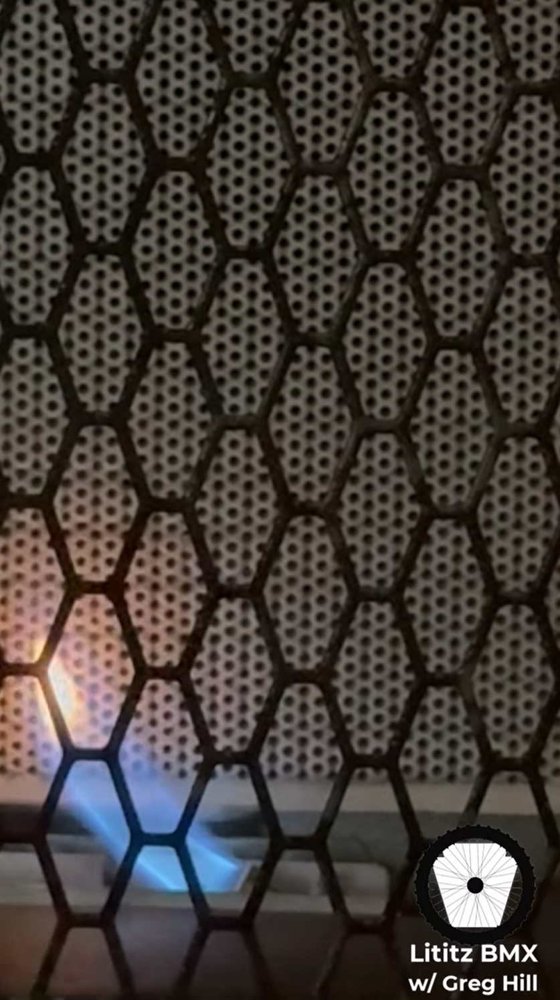

<p align="center">
  <a href="https://youtube.com/shorts/-3a9hJjboOE">
    
  </a>
</p>

<p align="center"><em>Shared published visual used across all 25 Greg Hill <em>Floored</em> Shorts. This cleaner frame remains a video-derived capture, not an original clean title-card file.</em></p>

<p align="center">[← GH-017](../GH-017/README.md) · [Brochure index](../../README.md) · [Parent dossier](../../../../README.md) · [GH-019 →](../GH-019/README.md)</p>

# GH-018 — Greg Hill on BMX “Bro Price” Culture and Thin Margins

> **Commercial-Grade BMX specification:** Standard pricing: professional flooring service without an assumed friendship discount.

> “In BMX, it’s all about the bro price.” — Greg Hill

## Project specification

| Field | Record |
|---|---|
| **Stable record ID** | `GH-018` |
| **Published sequence** | 18 of 25 |
| **Brochure system** | [Commercial-Grade BMX](../../README.md#commercial-grade-bmx) |
| **Published** | 2025-06-05 |
| **Duration** | 0:36 |
| **Visibility / state** | Public / Published |
| **Evidence-snapshot engagement** | 20 views; 0 comments on 2026-07-22 |
| **Direct Short** | [Watch on YouTube](https://youtube.com/shorts/-3a9hJjboOE) |
| **Playlist** | [Open the enhanced clip playlist](https://youtube.com/playlist?list=PLPoYIOMe8Ph8) |
| **Parent transcript alignment** | 14:38–15:08 |

## Project overview

Greg Hill contrasts BMX requests for a “bro price” or hookup with flooring customers who generally expect to pay for a professional service. He characterizes BMX margins as terrible.

## Evidentiary treatment

**Claim status:** attributed firsthand business opinion.

- No additional record-specific qualification beyond the claim-status statement.

## Published record

**Exact published title:**

> 18: Greg Hill talks about the "bro-price" -a staple in BMX- "my price" - not an issue in flooring

<details>
<summary><strong>View the complete published YouTube description</strong></summary>

Join us for a short clip of BMX legend Greg Hill discussing the BMX "Bro Price" and why "What's my price?" isn't an issue in the flooring business, while Greg is in the bidding process for our two-car garage floor. Clips that will discuss topics such as Greg's friendship with Harry Leary; Stu Thomsen, Harry Leary, Greg Hill, and Clint Miller practicing gates at Greg Hill's house when he was a teenager; answer the questions:
   - Is Greg Hill happy?
   - Is humidity going to be an issue?
   - And more...
We invite you to join us and thank you for your time.
Learn more about Greg’s ‘new’ business: www.epoxysurfaceprosca.com
Full length interview available at: https://youtu.be/6N59-8oiRPw?feature=shared
📚 About Lititz BMX

Lititz BMX is an independent BMX preservation project dedicated to documenting and preserving the people, bikes, artifacts, race history, and stories that shaped the sport.

What began as a private collection has grown into an expanding digital archive featuring hundreds of artifacts, rider profiles, interviews, educational resources, and historical research spanning BMX’s earliest days through today.

Every artifact tells a story. Every rider leaves a legacy. Every piece of BMX history deserves to be preserved. Each recording helps preserve BMX history by documenting the people, artifacts, and stories that might otherwise be lost to time.

🔗 Discover More in the Archive

This recording is one chapter in the story of the Lititz BMX Archive.

Whether you're researching BMX history, rediscovering a favorite rider, or exploring the stories behind the artifacts, there's always something new waiting in the archive.

🏁 Explore Lititz BMX
https://www.lititzbmx.com

📚 Explore the Complete Archive
https://sites.google.com/view/lititzbmxinventorylist/
⭐ Featured Archive Highlights

🔹 Archive Artifact - 26.0035 - JAG Kit with Oakley Factor Pilot Decal
https://sites.google.com/view/lititzbmxinventorylist/home/26-0035

🔹 The Harry Leary CTE Education Center
https://sites.google.com/view/lititzbmxinventorylist/learning-resources/cte-education-center

🔹 Archive Artifact - 26.0038 - Jeremy McGrath Signed (Twice) Specialized Harry Leary’s Personal Frame
 https://sites.google.com/view/lititzbmxinventorylist/home/26-0038
The Lititz BMX Archive is independently developed and maintained.

Sharing recordings, identifying artifacts, contributing historical information, and connecting riders with the archive are some of the best ways to help preserve BMX history.

 • Museum-quality BMX artifacts
 • BMX team and manufacturer history
 • Vintage BMX memorabilia and catalogs
 • International BMX history
 • Educational resources and historical research
 • Original photographs, videos, and documents
 • Original Lititz BMX media productions
 • Restoration projects and behind-the-scenes stories

New artifacts, rider profiles, interviews, and historical resources are added regularly as the Lititz BMX Archive continues to grow.
#garage #garagefloor #garageflooring #bmx #bmxlife #bmxplus #bmxculture #wherearetheynow #80s #oldschoolbmx #midschoolbmx #vintagebmx podcast


</details>

[Open the description as a standalone evidence file](published-description.md)

## Transcript and parent context

### Supplied Short-level transcript

```text
and not having anyone say, "Hey, can you hook me up? What's my price? What's my," you know, in BMX, it's all about the bro price, right? When I go to a floor, I don't ever hear anything like that. Yeah. You're just a normal person going to do a service and you get paid and Yeah. In BMX, the business is just it's just so unbelievably terrible. Yeah. I can only imagine. I've heard, you know, stories of being frame manufacturers and kind of just getting hit up and the margins aren't great to begin with. So, how much can you actually give away? The margins are are terrible.
```

[Open the preserved transcript file](supplied-transcript.txt)

### Timestamped parent-recording alignment

The corresponding passage is aligned to **14:38–15:08** in the existing parent transcript. This access excerpt preserves the parent transcript wording as already compiled:

```text
14:3814 minutes, 38 secondsknow, sometimes in one day more than it took me two weeks to make in BMX. And not having anyone say, "Hey, can you hook me up? What's my price? What's my,
14:4714 minutes, 47 secondsyou know, In BMX, it's all about the bro price, right? When I go to a floor, I don't ever hear anything like that.
14:5214 minutes, 52 secondsYeah. You're just a normal person going to do a service and you get paid. And in BMX, the business is just it's just so
15:0015 minutesunbelievably terrible. Yeah. I can only imagine. I've heard, you know, stories of being frame manufacturers and kind of just getting hit up. And the margins
15:0815 minutes, 8 secondsaren't great to begin with. So, how much can you actually give away? The margin the margins are are terrible. And the problem is there's too many frame. when we stopped there was like 250 different frames on the market, you know. Yeah.
```

[Open the alignment excerpt](parent-transcript-alignment.txt) · [Open the complete timestamped parent transcript](../../../../source/original-transcript-timestamped.txt)

## People, organizations, and subjects

**People:** Greg Hill, Kyle A. Huffman  
**Organizations:** Greg Hill Products, Epoxy Surface Professionals

- BMX bro price
- friendship discounts
- BMX frame manufacturing
- profit margins
- professional service pricing

## Machine-readable record

[Open metadata.json](metadata.json)

---

<p align="center">[← GH-017](../GH-017/README.md) · [Brochure index](../../README.md) · [Parent dossier](../../../../README.md) · [GH-019 →](../GH-019/README.md)</p>
