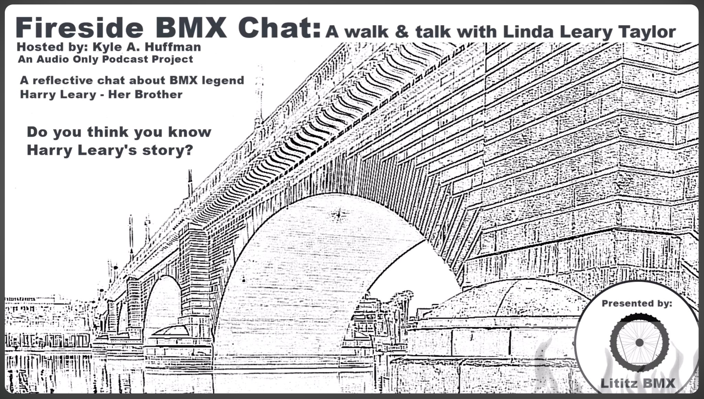

  

# A Walk & Talk with Linda Leary Taylor

<strong><a href="https://www.youtube.com/watch?v=2EWCctB6bss">▶ Watch the complete recording on YouTube</a></strong>

## At a glance

| Field | Record |
|---|---|
| **Record ID** | `fbc-linda-leary-taylor-walk-talk` |
| **Dossier type** | Interview Dossier |
| **Classification** | On-location memorial walk, family oral history, and place-based remembrance interview. |
| **Participants** | Kyle A. Huffman, Linda Leary Taylor, Anne-Marie Huffman |
| **Setting** | London Bridge and Memorial Walkway, Lake Havasu City, Arizona |
| **Duration** | 1:13:28 |
| **Preservation status** | Dossier compiled; machine transcript preserved; full audio verification pending |

## Record summary

Kyle, Anne-Marie, and Linda Leary Taylor walk across London Bridge toward Harry Leary’s memorial paver. Linda shares childhood memories, family relationships, Harry’s early riding, his professional life, personal relationships, family concerns, his death, and her evolving understanding of his legacy.

## Why this recording matters

The physical walk provides the interview’s memorial structure and preserves family testimony largely absent from race records and magazine coverage.

## Explore the dossier

| Public record | Context and provenance | Transcript and access |
|---|---|---|
| [Interview Record](interview-record.md) | [Dossier Contents](docs/dossier-contents.md) | [Working Transcript](transcript/working-transcript.md) |
| [Published Description](source/published-description.md) | [Provenance](docs/provenance.md) | [Transcript Status](docs/transcript-status.md) |
| [YouTube Record](source/youtube-record.md) | [Curator Notes](docs/curator-notes.md) | [Preliminary Chapter Index](docs/chapter-index.md) |
| [Metadata](metadata.json) | [Source Inventory](docs/source-inventory.md) | [Topic Index](docs/topic-index.md) |
| [Citation Record](CITATION.cff) | [Verification Notes](docs/verification-notes.md) | [Rights and Access](docs/rights-and-access.md) |

## Archival authority

The original recording is the primary source. The raw transcript is preserved unchanged as an access aid. Descriptive files identify testimony as testimony and record contradictions rather than silently resolving them.

## Current status

- source package compiled;
- public/private review completed;
- visual access layer completed;
- machine transcript preserved;
- full audio verification pending.
