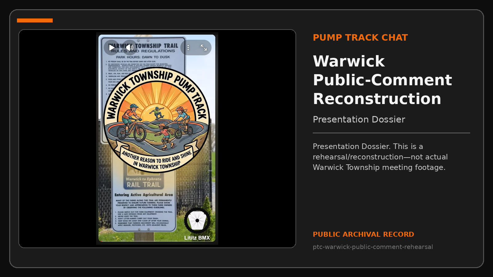
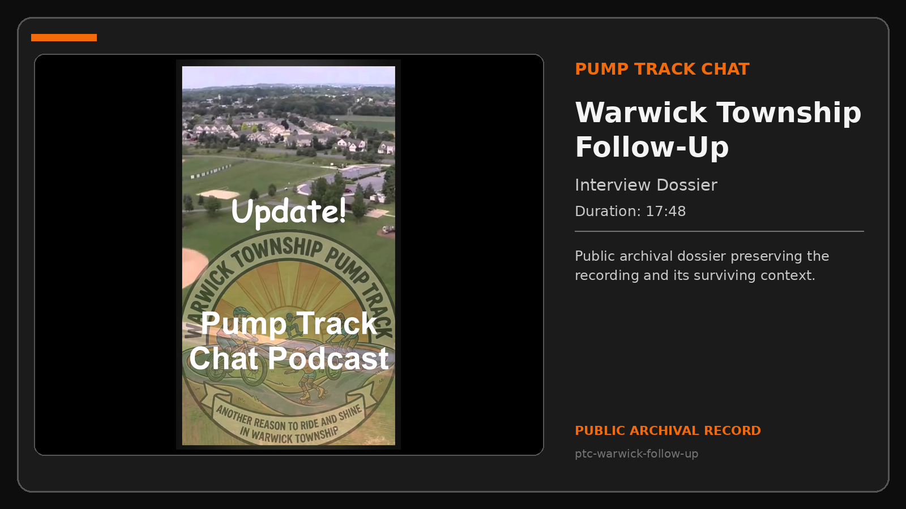
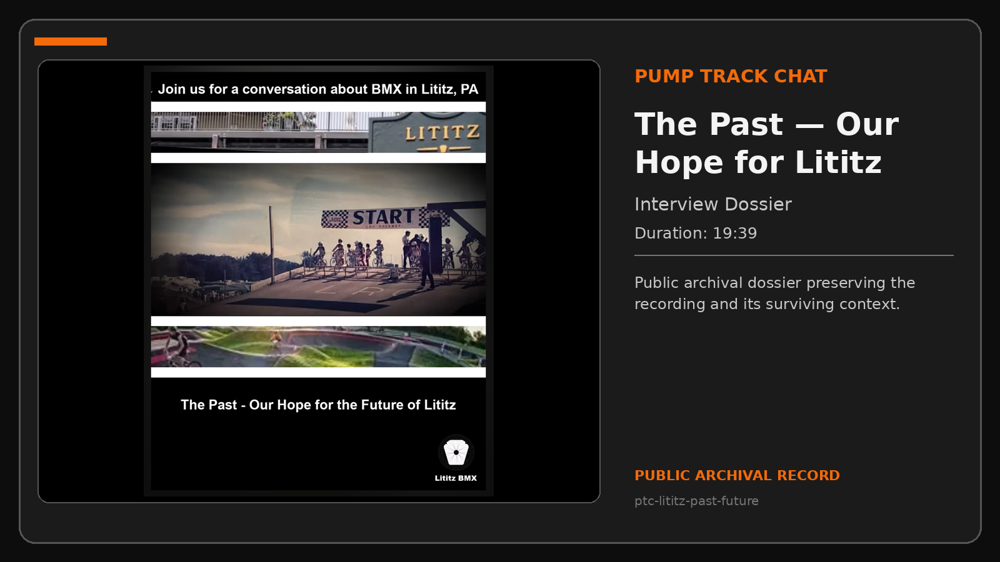
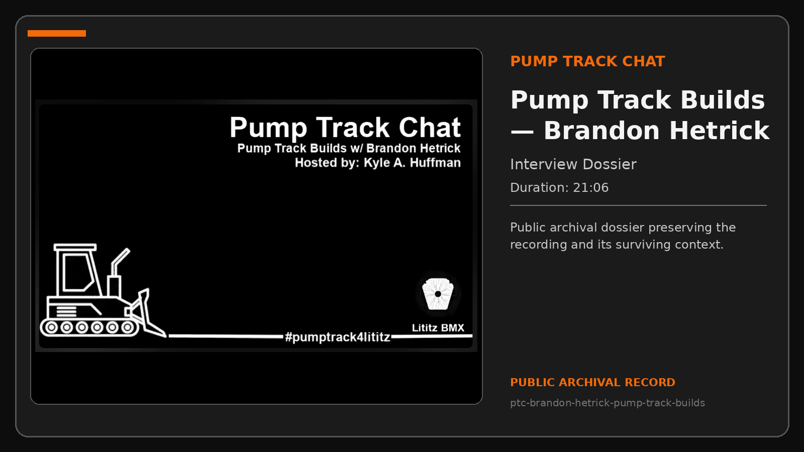

# Pump Track Chat

Pump Track Chat preserves planning conversations, public advocacy, local BMX history, access discussions, and professional track-building knowledge connected to the Warwick Township pump-track effort.

**Compiled dossiers:** 5  
**Public package:** v1.2.0  
**Dossier types:** Interview and Presentation Dossiers

## Visual dossier index

<table>
<tr>
<td width="34%" valign="top"></td>
<td valign="top"><strong><a href="records/ptc-warwick-public-comment-rehearsal/README.md">Warwick Township Pump Track Public-Comment Rehearsal / Reconstruction</a></strong> A recreation of Kyle A.   <strong>Duration:</strong> Not supplied <strong>Type:</strong> Presentation Dossier <a href="https://www.youtube.com/@LititzBMX17543">Source channel</a> · <a href="records/ptc-warwick-public-comment-rehearsal/presentation-record.md">Open Presentation Record</a>  <em>Presentation Dossier. This is a rehearsal/reconstruction—not actual Warwick Township meeting footage.</em></td>
</tr>
<tr>
<td width="34%" valign="top"></td>
<td valign="top"><strong><a href="records/ptc-warwick-follow-up/README.md">Update! Pump Track Chat Podcast — Warwick Township Follow-Up</a></strong> Kyle and John Stancliff review the Warwick Township supervisors presentation, the board’s reception, Township Manager Brian Harris’s response, site and land-size possibilities, grassroots and municipal build paths, and preparation for the…  <strong>Duration:</strong> 17:48 <strong>Type:</strong> Interview Dossier <a href="https://www.youtube.com/@LititzBMX17543">Source channel</a> · <a href="records/ptc-warwick-follow-up/interview-record.md">Open Interview Record</a></td>
</tr>
<tr>
<td width="34%" valign="top"></td>
<td valign="top"><strong><a href="records/ptc-lititz-past-future/README.md">The Past — Our Hope for the Future of Lititz</a></strong> John Stancliff recalls the former BMX track in Lititz, how he discovered and raced there, local and regional BMX competition, and how a modern pump track could restore accessible wheeled recreation to the community.  <strong>Duration:</strong> 19:39 <strong>Type:</strong> Interview Dossier <a href="https://www.youtube.com/@LititzBMX17543">Source channel</a> · <a href="records/ptc-lititz-past-future/interview-record.md">Open Interview Record</a></td>
</tr>
<tr>
<td width="34%" valign="top"></td>
<td valign="top"><strong><a href="records/ptc-brandon-hetrick-pump-track-builds/README.md">Pump Track Builds with Brandon Hetrick</a></strong> Brandon Hetrick discusses his background building BMX tracks, skateparks, pump tracks, and event features; community planning; ADA-friendly and adaptive-rider considerations; construction timing; drainage; tourism; local-business effects;…  <strong>Duration:</strong> 21:06 <strong>Type:</strong> Interview Dossier <a href="https://www.youtube.com/@LititzBMX17543">Source channel</a> · <a href="records/ptc-brandon-hetrick-pump-track-builds/interview-record.md">Open Interview Record</a></td>
</tr>
<tr>
<td width="34%" valign="top"></td>
<td valign="top"><strong><a href="records/ptc-brandon-hetrick-coleman-warwick-update/README.md">Pump Track Chat #2: Coleman Bike Park and Hope for Warwick Township</a></strong> Kyle A. Huffman and Brandon Hetrick revisit the completed Coleman Memorial Park pump track in Lebanon, discuss how relationships, volunteer effort, municipal coordination, materials, and design shaped the project, and apply those lessons to the continuing Warwick Township / Lititz pump-track effort and a possible Rock Lititz path.  <strong>Duration:</strong> Not supplied <strong>Type:</strong> Interview Dossier <a href="https://www.youtube.com/watch?v=sMhoaIE3TKY">Watch recording</a> · <a href="records/ptc-brandon-hetrick-coleman-warwick-update/interview-record.md">Open Interview Record</a>  <em>Source screenshot showed the upload as unlisted; final title and description are preserved, while public launch date remains unverified.</em></td>
</tr>
</table>

## Archival treatment

- Interview testimony is kept distinct from independently verified municipal facts.
- The Warwick public-comment record is labeled throughout as a rehearsal/reconstruction, not actual meeting footage.
- Planning estimates and professional opinions remain attributed to their speakers.

[Return to the complete Record Collection](../../README.md)
