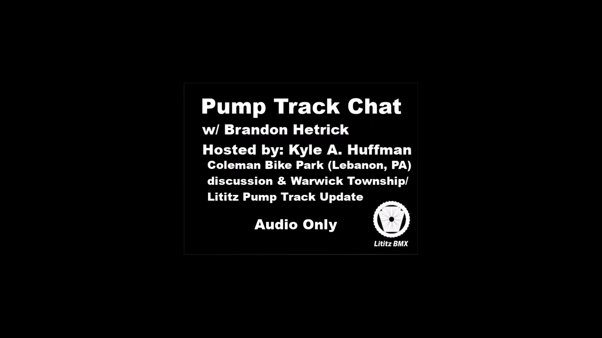

# Pump Track Chat #2: Coleman Bike Park and Hope for Warwick Township

[▶ Watch the recording on YouTube](https://www.youtube.com/watch?v=sMhoaIE3TKY)

**Record identifier:** `ptc-brandon-hetrick-coleman-warwick-update`  
**Collection:** Pump Track Chat  
**Episode:** 2  
**Dossier type:** Interview Dossier  
**Upload record date shown:** 2026-07-21  
**Visibility at source capture:** Unlisted  
**Public launch date:** Not supplied  
**Transcript status:** Machine transcript captured; corrected access layer present; audio verification pending

## Record summary

Kyle A. Huffman and Brandon Hetrick revisit the completed Coleman Memorial Park pump track in Lebanon, discuss how relationships, volunteer effort, municipal coordination, materials, and design shaped the project, and apply those lessons to the continuing Warwick Township / Lititz pump-track effort and a possible Rock Lititz path.

## Why this recording matters

The recording preserves a project-builder’s retrospective on the Coleman Bike Park build while documenting a specific stage in Lititz BMX’s Warwick Township advocacy. It also records the memorial meaning attached to the Coleman track, Brandon Hetrick’s memories of Corey Martin and Lebanon-area trail culture, and the practical contrast between municipal and privately supported projects.

## Publication-status note

The supplied YouTube screenshot documents the upload while it was **unlisted** and still carried a working “do not distribute” title. Kyle A. Huffman later supplied the final 100-character public-facing title and the complete standardized description preserved in this dossier. A separate screenshot confirming the later public launch was not supplied, so this record does not invent a launch time or visibility change.

## Explore the dossier

| Public record | Context and provenance | Transcript and access |
|---|---|---|
| [Interview Record](interview-record.md) | [Dossier Contents](docs/dossier-contents.md) | [Open Working Transcript](transcript/working-transcript.md) |
| [Published Description Snapshot](source/published-description.md) | [Provenance](docs/provenance.md) | [Open Corrected Machine Transcript](transcript/corrected-machine-transcript.md) |
| [YouTube / Source Record](source/youtube-record.md) | [Curator Notes](docs/curator-notes.md) | [Transcript Status](docs/transcript-status.md) |
| [Metadata](metadata.json) | [Source Inventory](docs/source-inventory.md) | [Sequence Index](docs/chapter-index.md) · [Topic Index](docs/topic-index.md) |
| [Citation Record](CITATION.cff) | [Verification Notes](docs/verification-notes.md) | [Rights and Access](docs/rights-and-access.md) · [Revision History](docs/revision-history.md) |

## Related records

- [Pump Track Builds with Brandon Hetrick](../ptc-brandon-hetrick-pump-track-builds/README.md)
- [Warwick Township follow-up](../ptc-warwick-follow-up/README.md)
- [Warwick public-comment rehearsal / reconstruction](../ptc-warwick-public-comment-rehearsal/README.md)
- [The Past — Our Hope for the Future of Lititz](../ptc-lititz-past-future/README.md)

## Archival authority

The recording is the primary source. The uploaded screenshot and raw machine transcript are preserved unchanged. The title-card crop, normalized transcript, indexes, and descriptive text are separately labeled archival access derivatives.
