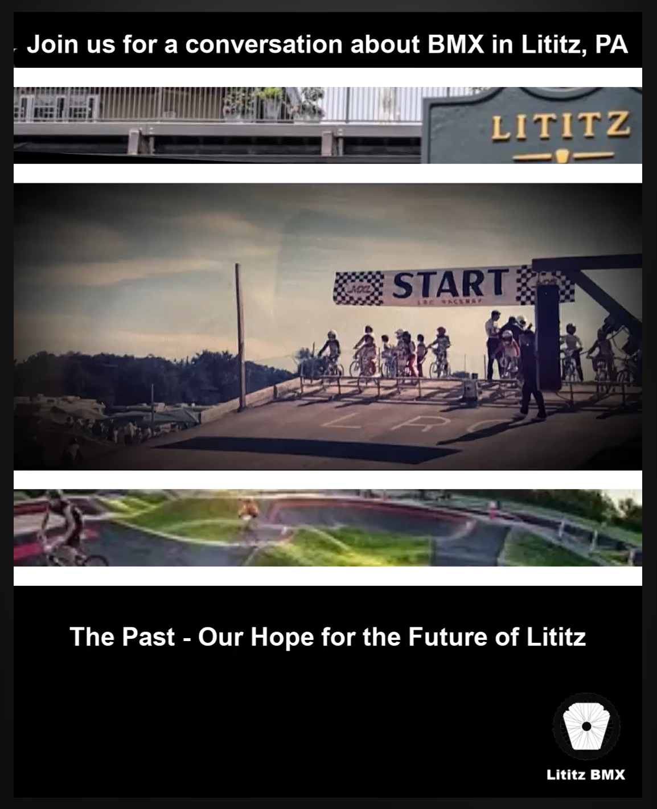

# The Past — Our Hope for the Future of Lititz

**Record ID:** `ptc-lititz-past-future`  
**Collection:** Pump Track Chat  
**Dossier type:** Interview Dossier  
**Duration:** 19:39  
**Preservation status:** Dossier compiled for v1.1.0 Part 1; verification gaps recorded

## Record summary

John Stancliff recalls the former BMX track in Lititz, how he discovered and raced there, local and regional BMX competition, and how a modern pump track could restore accessible wheeled recreation to the community.

## Why this recording matters

Connects first-person local BMX memory with present-day advocacy and preserves testimony about the former Lititz track, nearby businesses, race culture, and community use.

## Source caution

The individual source URL, publication date, duration, or exact platform title is marked as unavailable whenever it was not present in the accessible build bundle. Missing information has not been invented.

## Explore the dossier

| Public record | Context and provenance | Transcript and access |
|---|---|---|
| [Interview Record](interview-record.md) | [Dossier Contents](docs/dossier-contents.md) | [Transcript Status](docs/transcript-status.md) |
| [Published Description Snapshot](source/published-description.md) | [Provenance](docs/provenance.md) | [Chapter Index](docs/chapter-index.md) |
| [YouTube / Source Record](source/youtube-record.md) | [Curator Notes](docs/curator-notes.md) | [Topic Index](docs/topic-index.md) |
| [Metadata](metadata.json) | [Source Inventory](docs/source-inventory.md) | [Rights and Access](docs/rights-and-access.md) |
| [Citation Record](CITATION.cff) | [Verification Notes](docs/verification-notes.md) | [Revision History](docs/revision-history.md) |

## Related records

- [Warwick public-comment rehearsal / reconstruction](../ptc-warwick-public-comment-rehearsal/README.md)
- [Warwick Township follow-up](../ptc-warwick-follow-up/README.md)
- [Pump Track Builds with Brandon Hetrick](../ptc-brandon-hetrick-pump-track-builds/README.md)

## Archival authority

The original recording is the primary source. Submitted images are preserved unchanged. Machine transcripts, when supplied, are preserved unchanged and corrected only in a separate labeled access layer.
