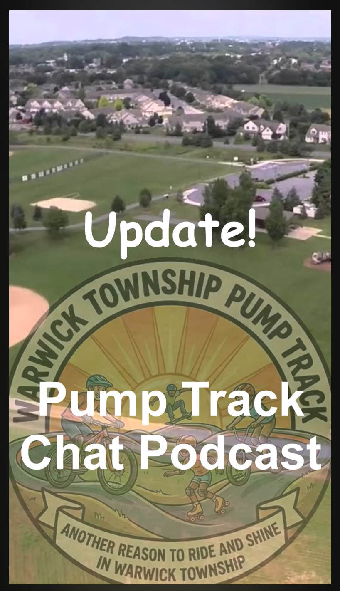

# Update! Pump Track Chat Podcast — Warwick Township Follow-Up

**Record ID:** `ptc-warwick-follow-up`  
**Collection:** Pump Track Chat  
**Dossier type:** Interview Dossier  
**Duration:** 17:48  
**Preservation status:** Dossier compiled for v1.1.0 Part 1; verification gaps recorded

## Record summary

Kyle and John Stancliff review the Warwick Township supervisors presentation, the board’s reception, Township Manager Brian Harris’s response, site and land-size possibilities, grassroots and municipal build paths, and preparation for the next recreation meeting.

## Why this recording matters

Preserves an immediate participant account of the pump-track proposal’s early public-government phase and the strategy that followed the supervisors meeting.

## Source caution

The individual source URL, publication date, duration, or exact platform title is marked as unavailable whenever it was not present in the accessible build bundle. Missing information has not been invented.

## Explore the dossier

| Public record | Context and provenance | Transcript and access |
|---|---|---|
| [Interview Record](interview-record.md) | [Dossier Contents](docs/dossier-contents.md) | [Transcript Status](docs/transcript-status.md) |
| [Published Description Snapshot](source/published-description.md) | [Provenance](docs/provenance.md) | [Chapter Index](docs/chapter-index.md) |
| [YouTube / Source Record](source/youtube-record.md) | [Curator Notes](docs/curator-notes.md) | [Topic Index](docs/topic-index.md) |
| [Metadata](metadata.json) | [Source Inventory](docs/source-inventory.md) | [Rights and Access](docs/rights-and-access.md) |
| [Citation Record](CITATION.cff) | [Verification Notes](docs/verification-notes.md) | [Revision History](docs/revision-history.md) |

## Related records

- [Warwick public-comment rehearsal / reconstruction](../ptc-warwick-public-comment-rehearsal/README.md)
- [The Past — Our Hope for the Future of Lititz](../ptc-lititz-past-future/README.md)
- [Pump Track Builds with Brandon Hetrick](../ptc-brandon-hetrick-pump-track-builds/README.md)

## Archival authority

The original recording is the primary source. Submitted images are preserved unchanged. Machine transcripts, when supplied, are preserved unchanged and corrected only in a separate labeled access layer.
