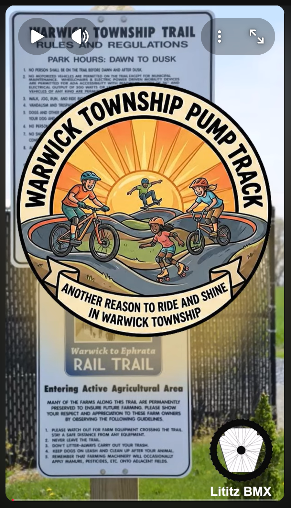

# Warwick Township Pump Track Public-Comment Rehearsal / Reconstruction

**Record ID:** `ptc-warwick-public-comment-rehearsal`  
**Collection:** Pump Track Chat  
**Dossier type:** Presentation Dossier  
**Duration:** Not supplied  
**Preservation status:** Dossier compiled for v1.1.0 Part 1; verification gaps recorded

## Record summary

A recreation of Kyle A. Huffman’s Warwick Township pump-track public comment prepared or recorded outside the actual government meeting. It preserves the intended presentation and advocacy message but is not meeting footage.

## Why this recording matters

Documents the Lititz BMX-led advocacy process for a Warwick Township pump track while clearly separating a later recreation from the official public-meeting record.

## Source caution

The individual source URL, publication date, duration, or exact platform title is marked as unavailable whenever it was not present in the accessible build bundle. Missing information has not been invented.

## Explore the dossier

| Public record | Context and provenance | Transcript and access |
|---|---|---|
| [Presentation Record](presentation-record.md) | [Dossier Contents](docs/dossier-contents.md) | [Transcript Status](docs/transcript-status.md) |
| [Published Description Snapshot](source/published-description.md) | [Provenance](docs/provenance.md) | [Chapter Index](docs/chapter-index.md) |
| [YouTube / Source Record](source/youtube-record.md) | [Curator Notes](docs/curator-notes.md) | [Topic Index](docs/topic-index.md) |
| [Metadata](metadata.json) | [Source Inventory](docs/source-inventory.md) | [Rights and Access](docs/rights-and-access.md) |
| [Citation Record](CITATION.cff) | [Verification Notes](docs/verification-notes.md) | [Revision History](docs/revision-history.md) |

## Related records

- [Warwick Township follow-up](../ptc-warwick-follow-up/README.md)
- [The Past — Our Hope for the Future of Lititz](../ptc-lititz-past-future/README.md)
- [Pump Track Builds with Brandon Hetrick](../ptc-brandon-hetrick-pump-track-builds/README.md)

## Archival authority

The original recording is the primary source. Submitted images are preserved unchanged. Machine transcripts, when supplied, are preserved unchanged and corrected only in a separate labeled access layer.
