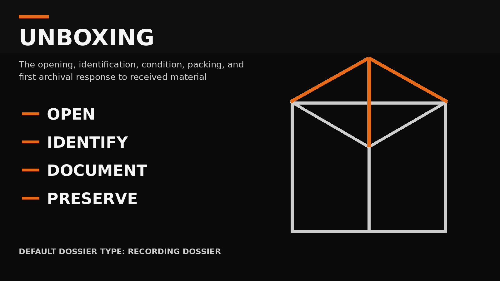

# Unboxing

**Category status:** Established  
**Default dossier type:** Recording Dossier

Unboxing records preserve the opening, identification, condition, packing, provenance clues, and first archival response to newly received material. The recording itself is usually the primary event rather than an interview.

## Current repository status

No complete Unboxing dossier is included in repository version 1.0.1. The category is established so future unboxings can be added without changing the collection architecture.

## Minimum future record

An Unboxing Recording Dossier should preserve:

- canonical recording and public description;
- package and packing condition;
- visible labels, markings, and provenance clues;
- first condition observations;
- identified and unidentified contents;
- photographs or title graphics supplied with the publication;
- follow-up corrections when the initial identification changes;
- privacy review for addresses, shipping labels, receipts, and contact information.

Future records should use the [Recording Dossier template](../../templates/recording-dossier/README.md).

[Return to Record Collection categories](../README.md)
