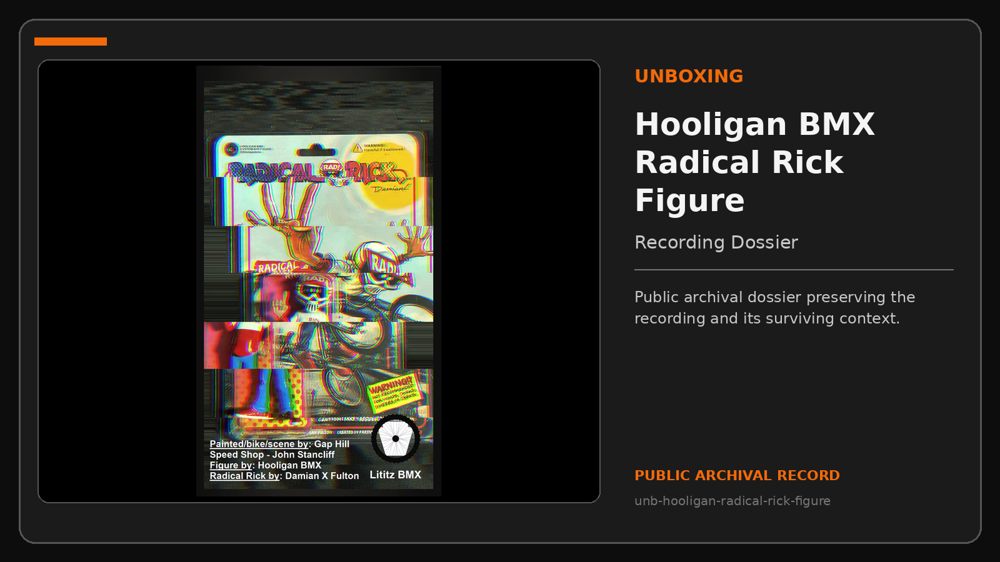
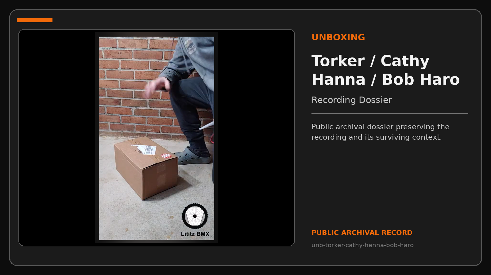
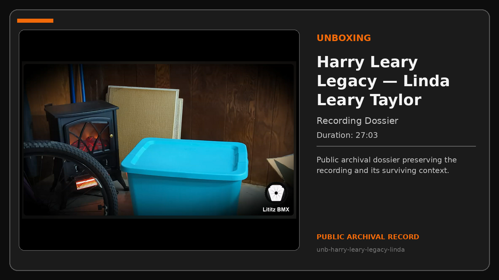
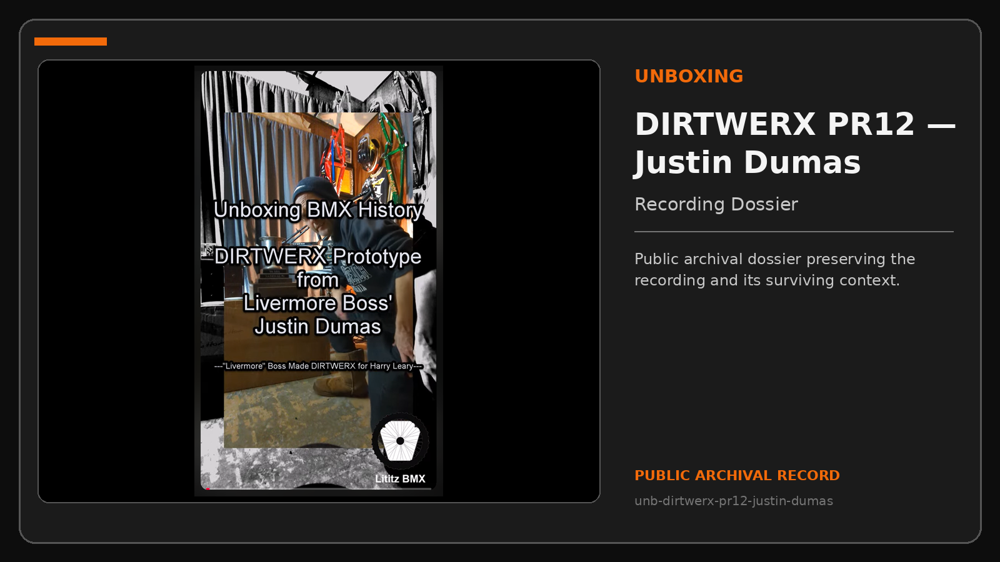
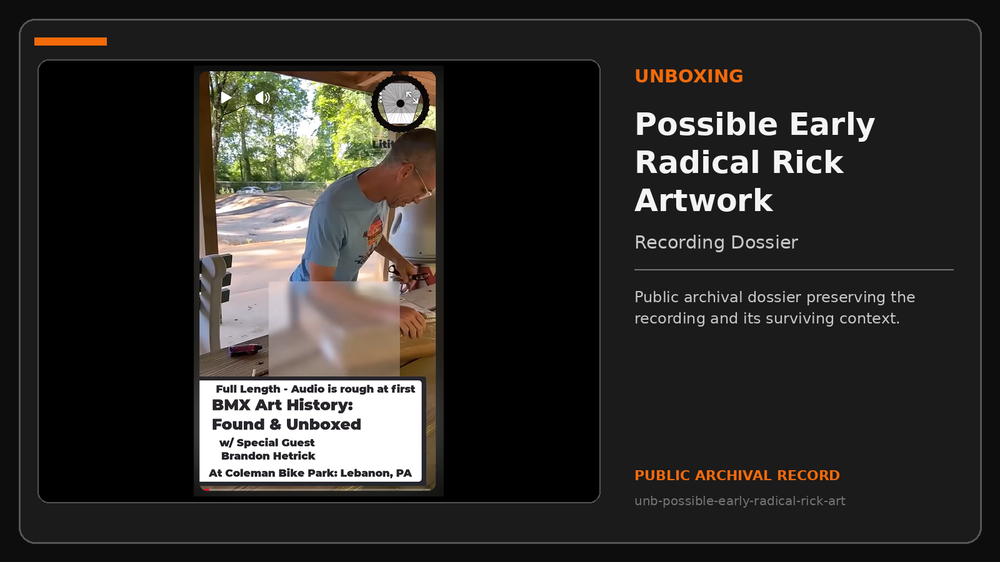
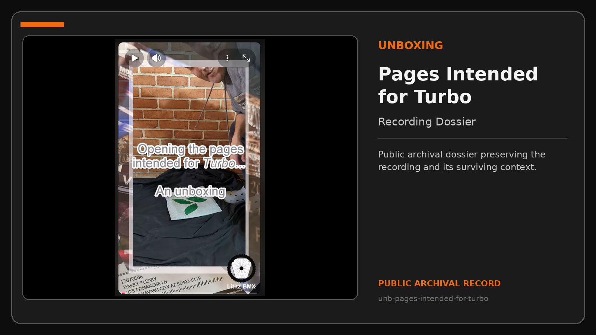
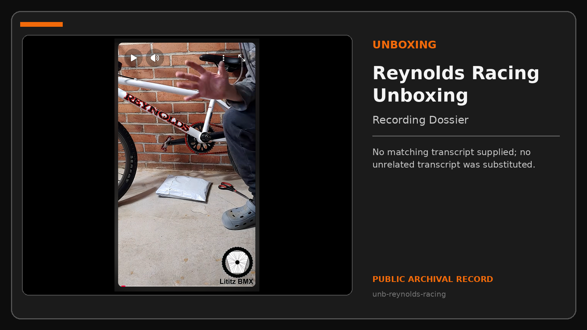
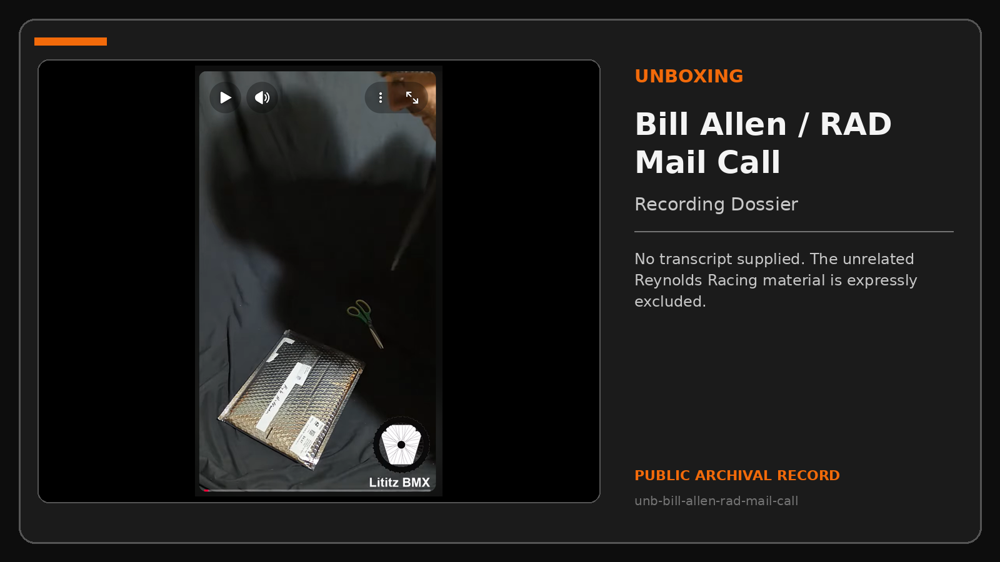
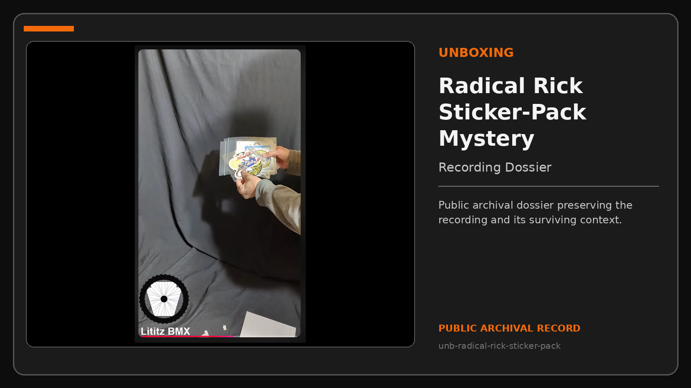

# Unboxing

Unboxing dossiers preserve the opening, identification, condition, packing, provenance clues, and first archival response to newly received material.

**Compiled dossiers:** 9  
**Public package:** v1.1.0  
**Dossier types:** Recording Dossier

## Visual dossier index

<table>
<tr>
<td width="34%" valign="top"></td>
<td valign="top"><strong><a href="records/unb-hooligan-radical-rick-figure/README.md">Custom Hooligan BMX Radical Rick 1:24 Figure</a></strong> A Lititz BMX unboxing and first-examination record for a custom 1:24-scale Radical Rick figure.   <strong>Duration:</strong> Not supplied <strong>Type:</strong> Recording Dossier <a href="https://www.youtube.com/@LititzBMX17543">Source channel</a> · <a href="records/unb-hooligan-radical-rick-figure/recording-record.md">Open Recording Record</a></td>
</tr>
<tr>
<td width="34%" valign="top"></td>
<td valign="top"><strong><a href="records/unb-torker-cathy-hanna-bob-haro/README.md">Torker / Cathy Hanna / Bob Haro Surprise Unboxing</a></strong> A package-opening record associated with Torker, Cathy Hanna, Bob Haro, shirts, and the signed BMX Action hat later preserved in the Lititz BMX collection.   <strong>Duration:</strong> Not supplied <strong>Type:</strong> Recording Dossier <a href="https://www.youtube.com/@LititzBMX17543">Source channel</a> · <a href="records/unb-torker-cathy-hanna-bob-haro/recording-record.md">Open Recording Record</a></td>
</tr>
<tr>
<td width="34%" valign="top"></td>
<td valign="top"><strong><a href="records/unb-harry-leary-legacy-linda/README.md">Harry Leary’s Personal BMX Legacy — Sent by Linda Leary Taylor</a></strong> Kyle opens and examines a group of Harry Leary-related objects while Linda Leary Taylor explains what she knows about the contents, including hats, shirts, a sweatband, a Supercross seat and post, a GT lanyard, a chain, a calendar, and…  <strong>Duration:</strong> 27:03 <strong>Type:</strong> Recording Dossier <a href="https://www.youtube.com/@LititzBMX17543">Source channel</a> · <a href="records/unb-harry-leary-legacy-linda/recording-record.md">Open Recording Record</a></td>
</tr>
<tr>
<td width="34%" valign="top"></td>
<td valign="top"><strong><a href="records/unb-dirtwerx-pr12-justin-dumas/README.md">Harry Leary DIRTWERX PR12 Prototype from Justin Dumas / Livermore Boss</a></strong> An unboxing and first examination of a frame presented in the historical publication as a DIRTWERX prototype connected to Harry Leary, Justin Dumas, and Livermore Boss.  <strong>Duration:</strong> Not supplied <strong>Type:</strong> Recording Dossier <a href="https://www.youtube.com/@LititzBMX17543">Source channel</a> · <a href="records/unb-dirtwerx-pr12-justin-dumas/recording-record.md">Open Recording Record</a></td>
</tr>
<tr>
<td width="34%" valign="top"></td>
<td valign="top"><strong><a href="records/unb-possible-early-radical-rick-art/README.md">BMX History Found? Possible Early Radical Rick Artwork with Brandon Hetrick</a></strong> Kyle and Brandon Hetrick examine artwork that the historical publication cautiously presents as possible early Radical Rick material.   <strong>Duration:</strong> Not supplied <strong>Type:</strong> Recording Dossier <a href="https://www.youtube.com/@LititzBMX17543">Source channel</a> · <a href="records/unb-possible-early-radical-rick-art/recording-record.md">Open Recording Record</a></td>
</tr>
<tr>
<td width="34%" valign="top"></td>
<td valign="top"><strong><a href="records/unb-pages-intended-for-turbo/README.md">Opening the Pages Intended for Turbo — An Unboxing</a></strong> An unboxing centered on pages described in the historical title as having been intended for “Turbo.” The source record preserves the opening event and the wording used at publication.  <strong>Duration:</strong> Not supplied <strong>Type:</strong> Recording Dossier <a href="https://www.youtube.com/@LititzBMX17543">Source channel</a> · <a href="records/unb-pages-intended-for-turbo/recording-record.md">Open Recording Record</a></td>
</tr>
<tr>
<td width="34%" valign="top"></td>
<td valign="top"><strong><a href="records/unb-reynolds-racing/README.md">Reynolds Racing Unboxing</a></strong> An unboxing record associated with a white Reynolds Racing BMX bicycle and a packaged item shown beside it.  <strong>Duration:</strong> Not supplied <strong>Type:</strong> Recording Dossier <a href="https://www.youtube.com/@LititzBMX17543">Source channel</a> · <a href="records/unb-reynolds-racing/recording-record.md">Open Recording Record</a>  <em>No matching transcript supplied; no unrelated transcript was substituted.</em></td>
</tr>
<tr>
<td width="34%" valign="top"></td>
<td valign="top"><strong><a href="records/unb-bill-allen-rad-mail-call/README.md">Bill Allen / RAD Movie Mail Call</a></strong> A mail-call and unboxing record for material supplied by Bill Allen and associated with the film RAD, including the signed manuscript/script and signed USA Today material identified in the Lititz BMX artifact records.  <strong>Duration:</strong> Not supplied <strong>Type:</strong> Recording Dossier <a href="https://www.youtube.com/@LititzBMX17543">Source channel</a> · <a href="records/unb-bill-allen-rad-mail-call/recording-record.md">Open Recording Record</a>  <em>No transcript supplied. The unrelated Reynolds Racing material is expressly excluded.</em></td>
</tr>
<tr>
<td width="34%" valign="top"></td>
<td valign="top"><strong><a href="records/unb-radical-rick-sticker-pack/README.md">Radical Rick Sticker-Pack Mystery Envelope</a></strong> An unboxing and examination of a mystery envelope containing Radical Rick sticker material associated with Damian X.   <strong>Duration:</strong> Not supplied <strong>Type:</strong> Recording Dossier <a href="https://www.youtube.com/@LititzBMX17543">Source channel</a> · <a href="records/unb-radical-rick-sticker-pack/recording-record.md">Open Recording Record</a></td>
</tr>
</table>

## Archival treatment

- Original publication images remain unchanged.
- Later corrections are made only in archival description and verification notes.
- Records without supplied transcripts state the gap explicitly; no transcript is borrowed or reconstructed.
- Shipping and contact details receive record-specific privacy review.

[Return to the complete Record Collection](../../README.md)
