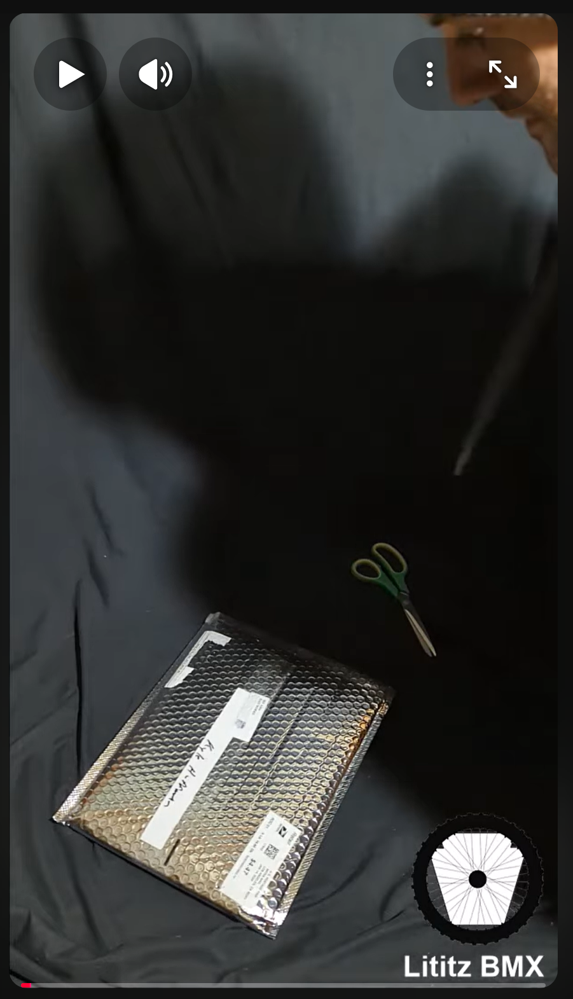

# Bill Allen / RAD Movie Mail Call

**Record ID:** `unb-bill-allen-rad-mail-call`  
**Collection:** Unboxing  
**Dossier type:** Recording Dossier  
**Duration:** Not supplied  
**Preservation status:** Dossier compiled for v1.1.0 Part 1; verification gaps recorded

## Record summary

A mail-call and unboxing record for material supplied by Bill Allen and associated with the film RAD, including the signed manuscript/script and signed USA Today material identified in the Lititz BMX artifact records.

## Why this recording matters

Documents the arrival context for film-related BMX artifacts connecting Bill Allen, RAD, media history, and the Lititz BMX collection.

## Source caution

The individual source URL, publication date, duration, or exact platform title is marked as unavailable whenever it was not present in the accessible build bundle. Missing information has not been invented.

## Explore the dossier

| Public record | Context and provenance | Transcript and access |
|---|---|---|
| [Recording Record](recording-record.md) | [Dossier Contents](docs/dossier-contents.md) | [Transcript Status](docs/transcript-status.md) |
| [Published Description Snapshot](source/published-description.md) | [Provenance](docs/provenance.md) | [Chapter Index](docs/chapter-index.md) |
| [YouTube / Source Record](source/youtube-record.md) | [Curator Notes](docs/curator-notes.md) | [Topic Index](docs/topic-index.md) |
| [Metadata](metadata.json) | [Source Inventory](docs/source-inventory.md) | [Rights and Access](docs/rights-and-access.md) |
| [Citation Record](CITATION.cff) | [Verification Notes](docs/verification-notes.md) | [Revision History](docs/revision-history.md) |

## Related records

- [Custom Hooligan BMX Radical Rick 1:24 Figure](../unb-hooligan-radical-rick-figure/README.md)
- [Fireside BMX Chat — Damian X. Fulton](../../../fireside-bmx-chat/records/fbc-001-damian-x-fulton/README.md)

## Archival authority

The original recording is the primary source. Submitted images are preserved unchanged. Machine transcripts, when supplied, are preserved unchanged and corrected only in a separate labeled access layer.
