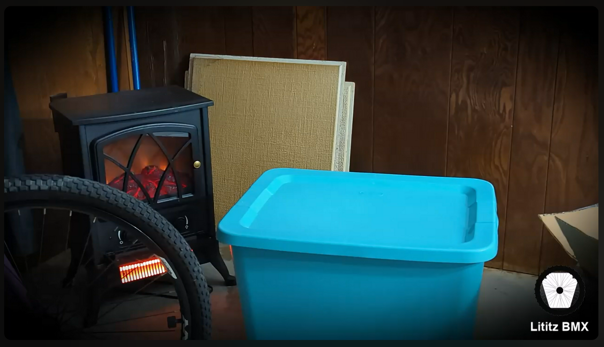

# Harry Leary’s Personal BMX Legacy — Sent by Linda Leary Taylor

**Record ID:** `unb-harry-leary-legacy-linda`  
**Collection:** Unboxing  
**Dossier type:** Recording Dossier  
**Duration:** 27:03  
**Preservation status:** Dossier compiled for v1.1.0 Part 1; verification gaps recorded

## Record summary

Kyle opens and examines a group of Harry Leary-related objects while Linda Leary Taylor explains what she knows about the contents, including hats, shirts, a sweatband, a Supercross seat and post, a GT lanyard, a chain, a calendar, and photographs. Linda repeatedly distinguishes what she knows from what she cannot confirm.

## Why this recording matters

Captures provenance at the moment of first examination and preserves family testimony linking personal objects to Harry Leary’s apartment, car, travels, clinics, bicycles, and relationships.

## Source caution

The individual source URL, publication date, duration, or exact platform title is marked as unavailable whenever it was not present in the accessible build bundle. Missing information has not been invented.

## Explore the dossier

| Public record | Context and provenance | Transcript and access |
|---|---|---|
| [Recording Record](recording-record.md) | [Dossier Contents](docs/dossier-contents.md) | [Transcript Status](docs/transcript-status.md) |
| [Published Description Snapshot](source/published-description.md) | [Provenance](docs/provenance.md) | [Chapter Index](docs/chapter-index.md) |
| [YouTube / Source Record](source/youtube-record.md) | [Curator Notes](docs/curator-notes.md) | [Topic Index](docs/topic-index.md) |
| [Metadata](metadata.json) | [Source Inventory](docs/source-inventory.md) | [Rights and Access](docs/rights-and-access.md) |
| [Citation Record](CITATION.cff) | [Verification Notes](docs/verification-notes.md) | [Revision History](docs/revision-history.md) |

## Related records

- [The Boy](../../../fireside-bmx-chat/records/fbc-005-the-boy-leary-ladies/README.md)
- [A Walk & Talk with Linda Leary Taylor](../../../fireside-bmx-chat/records/fbc-linda-leary-taylor-walk-talk/README.md)
- [Lost Linda Leary Taylor / DIRTWERX conversation](../../../fireside-bmx-chat/records/fbc-lost-linda-leary-taylor-dirtwerx/README.md)

## Archival authority

The original recording is the primary source. Submitted images are preserved unchanged. Machine transcripts, when supplied, are preserved unchanged and corrected only in a separate labeled access layer.
