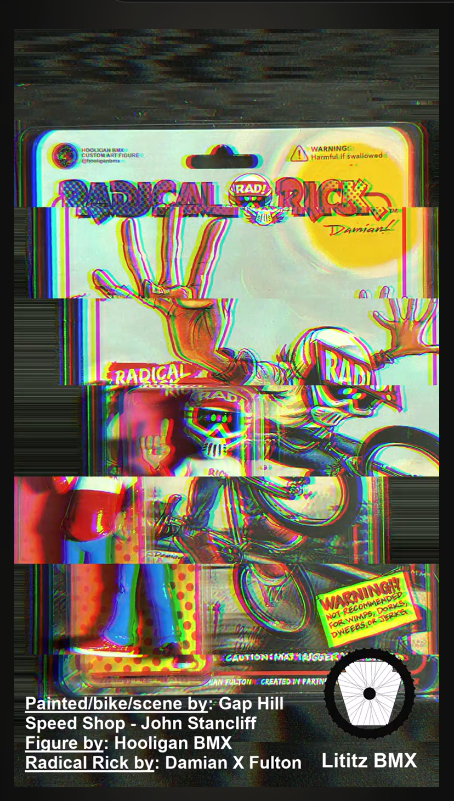

# Custom Hooligan BMX Radical Rick 1:24 Figure

**Record ID:** `unb-hooligan-radical-rick-figure`  
**Collection:** Unboxing  
**Dossier type:** Recording Dossier  
**Duration:** Not supplied  
**Preservation status:** Dossier compiled for v1.1.0 Part 1; verification gaps recorded

## Record summary

A Lititz BMX unboxing and first-examination record for a custom 1:24-scale Radical Rick figure. The supplied packaging image credits Hooligan BMX for the figure, Damian X. Fulton for Radical Rick, John Stancliff / Gap Hill Speed Shop for the painted bicycle and scene, and Lititz BMX as the preserving project.

## Why this recording matters

Documents a contemporary fan-made interpretation of Radical Rick and the collaboration among BMX artists, builders, collectors, and the Lititz BMX preservation project.

## Source caution

The individual source URL, publication date, duration, or exact platform title is marked as unavailable whenever it was not present in the accessible build bundle. Missing information has not been invented.

## Explore the dossier

| Public record | Context and provenance | Transcript and access |
|---|---|---|
| [Recording Record](recording-record.md) | [Dossier Contents](docs/dossier-contents.md) | [Transcript Status](docs/transcript-status.md) |
| [Published Description Snapshot](source/published-description.md) | [Provenance](docs/provenance.md) | [Chapter Index](docs/chapter-index.md) |
| [YouTube / Source Record](source/youtube-record.md) | [Curator Notes](docs/curator-notes.md) | [Topic Index](docs/topic-index.md) |
| [Metadata](metadata.json) | [Source Inventory](docs/source-inventory.md) | [Rights and Access](docs/rights-and-access.md) |
| [Citation Record](CITATION.cff) | [Verification Notes](docs/verification-notes.md) | [Revision History](docs/revision-history.md) |

## Related records

- [Fireside BMX Chat — Damian X. Fulton](../../../fireside-bmx-chat/records/fbc-001-damian-x-fulton/README.md)
- [Bill Allen / RAD Movie Mail Call](../unb-bill-allen-rad-mail-call/README.md)
- [Radical Rick Sticker-Pack Mystery Envelope](../unb-radical-rick-sticker-pack/README.md)

## Archival authority

The original recording is the primary source. Submitted images are preserved unchanged. Machine transcripts, when supplied, are preserved unchanged and corrected only in a separate labeled access layer.
