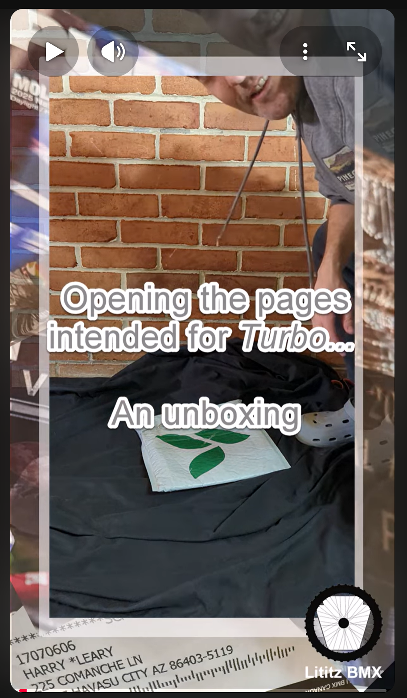

# Opening the Pages Intended for Turbo — An Unboxing

**Record ID:** `unb-pages-intended-for-turbo`  
**Collection:** Unboxing  
**Dossier type:** Recording Dossier  
**Duration:** Not supplied  
**Preservation status:** Dossier compiled for v1.1.0 Part 1; verification gaps recorded

## Record summary

An unboxing centered on pages described in the historical title as having been intended for “Turbo.” The source record preserves the opening event and the wording used at publication.

## Why this recording matters

Preserves the arrival and first examination of paper material linked by the publication to the Harry Leary Turbo context.

## Source caution

The individual source URL, publication date, duration, or exact platform title is marked as unavailable whenever it was not present in the accessible build bundle. Missing information has not been invented.

## Explore the dossier

| Public record | Context and provenance | Transcript and access |
|---|---|---|
| [Recording Record](recording-record.md) | [Dossier Contents](docs/dossier-contents.md) | [Transcript Status](docs/transcript-status.md) |
| [Published Description Snapshot](source/published-description.md) | [Provenance](docs/provenance.md) | [Chapter Index](docs/chapter-index.md) |
| [YouTube / Source Record](source/youtube-record.md) | [Curator Notes](docs/curator-notes.md) | [Topic Index](docs/topic-index.md) |
| [Metadata](metadata.json) | [Source Inventory](docs/source-inventory.md) | [Rights and Access](docs/rights-and-access.md) |
| [Citation Record](CITATION.cff) | [Verification Notes](docs/verification-notes.md) | [Revision History](docs/revision-history.md) |

## Related records

- [Harry Leary’s Personal BMX Legacy — Sent by Linda Leary Taylor](../unb-harry-leary-legacy-linda/README.md)

## Archival authority

The original recording is the primary source. Submitted images are preserved unchanged. Machine transcripts, when supplied, are preserved unchanged and corrected only in a separate labeled access layer.
