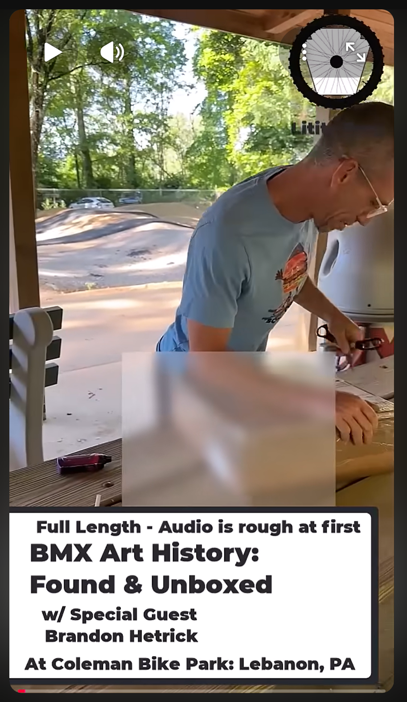

# BMX History Found? Possible Early Radical Rick Artwork with Brandon Hetrick

**Record ID:** `unb-possible-early-radical-rick-art`  
**Collection:** Unboxing  
**Dossier type:** Recording Dossier  
**Duration:** Not supplied  
**Preservation status:** Dossier compiled for v1.1.0 Part 1; verification gaps recorded

## Record summary

Kyle and Brandon Hetrick examine artwork that the historical publication cautiously presents as possible early Radical Rick material. The title itself records uncertainty and warns that the audio is rough at first.

## Why this recording matters

Documents an attribution question at the moment of discovery without converting a tentative identification into settled authorship.

## Source caution

The individual source URL, publication date, duration, or exact platform title is marked as unavailable whenever it was not present in the accessible build bundle. Missing information has not been invented.

## Explore the dossier

| Public record | Context and provenance | Transcript and access |
|---|---|---|
| [Recording Record](recording-record.md) | [Dossier Contents](docs/dossier-contents.md) | [Transcript Status](docs/transcript-status.md) |
| [Published Description Snapshot](source/published-description.md) | [Provenance](docs/provenance.md) | [Chapter Index](docs/chapter-index.md) |
| [YouTube / Source Record](source/youtube-record.md) | [Curator Notes](docs/curator-notes.md) | [Topic Index](docs/topic-index.md) |
| [Metadata](metadata.json) | [Source Inventory](docs/source-inventory.md) | [Rights and Access](docs/rights-and-access.md) |
| [Citation Record](CITATION.cff) | [Verification Notes](docs/verification-notes.md) | [Revision History](docs/revision-history.md) |

## Related records

- [Pump Track Builds with Brandon Hetrick](../../../pump-track-chat/records/ptc-brandon-hetrick-pump-track-builds/README.md)
- [Fireside BMX Chat — Damian X. Fulton](../../../fireside-bmx-chat/records/fbc-001-damian-x-fulton/README.md)

## Archival authority

The original recording is the primary source. Submitted images are preserved unchanged. Machine transcripts, when supplied, are preserved unchanged and corrected only in a separate labeled access layer.
