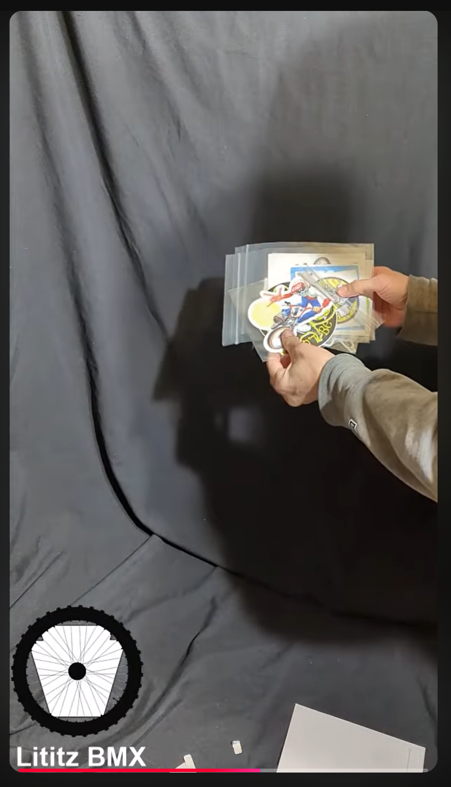

# Radical Rick Sticker-Pack Mystery Envelope

**Record ID:** `unb-radical-rick-sticker-pack`  
**Collection:** Unboxing  
**Dossier type:** Recording Dossier  
**Duration:** Not supplied  
**Preservation status:** Dossier compiled for v1.1.0 Part 1; verification gaps recorded

## Record summary

An unboxing and examination of a mystery envelope containing Radical Rick sticker material associated with Damian X. Fulton.

## Why this recording matters

Preserves small-format Radical Rick ephemera and its arrival context as part of the continuing relationship between the artist, character, collectors, and Lititz BMX.

## Source caution

The individual source URL, publication date, duration, or exact platform title is marked as unavailable whenever it was not present in the accessible build bundle. Missing information has not been invented.

## Explore the dossier

| Public record | Context and provenance | Transcript and access |
|---|---|---|
| [Recording Record](recording-record.md) | [Dossier Contents](docs/dossier-contents.md) | [Transcript Status](docs/transcript-status.md) |
| [Published Description Snapshot](source/published-description.md) | [Provenance](docs/provenance.md) | [Chapter Index](docs/chapter-index.md) |
| [YouTube / Source Record](source/youtube-record.md) | [Curator Notes](docs/curator-notes.md) | [Topic Index](docs/topic-index.md) |
| [Metadata](metadata.json) | [Source Inventory](docs/source-inventory.md) | [Rights and Access](docs/rights-and-access.md) |
| [Citation Record](CITATION.cff) | [Verification Notes](docs/verification-notes.md) | [Revision History](docs/revision-history.md) |

## Related records

- [Fireside BMX Chat — Damian X. Fulton](../../../fireside-bmx-chat/records/fbc-001-damian-x-fulton/README.md)
- [Custom Hooligan BMX Radical Rick 1:24 Figure](../unb-hooligan-radical-rick-figure/README.md)

## Archival authority

The original recording is the primary source. Submitted images are preserved unchanged. Machine transcripts, when supplied, are preserved unchanged and corrected only in a separate labeled access layer.
